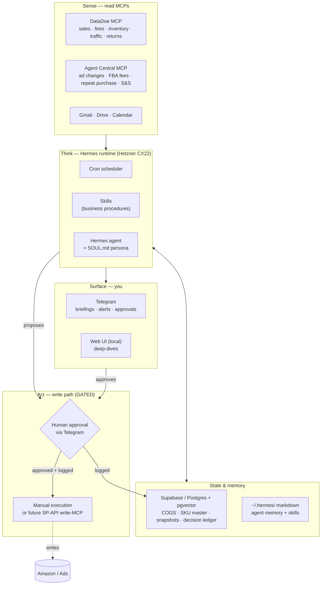

> **Revised 2026-06-08.** Three changes override anything below: (1) runtime is the **Hermes Mac desktop app**, not a Hetzner server — see CLAUDE.md "Runtime" for the scheduling implication; (2) **Agent Central is not used** — DataDoe is the single Amazon data source (see 04 for the real sources); (3) milestone order is **PPC-first**, then listings (see 03). Where this document conflicts with CLAUDE.md / 03 / 04, those win. The layering and guardrail philosophy below still hold.

# Habib OS — Architecture on Hermes

A self-hosted operating layer for Habib Distribution, built on the Hermes agent runtime, with DataDoe as the primary analytics source and Agent Central for ads/FBA/retention data.

---

## 1. The one design constraint that shapes everything

**Your data tools are read-only.**

- **DataDoe** is a structured query engine over your Amazon dataset — `sources → create export → poll → download`, with SQL-style filters, group-by, aggregations, and date ranges. It *reads*. It does not change prices, budgets, or inventory.
- **Agent Central** is the same story for ads-change history, FBA storage fees, repeat-purchase behaviour, and Subscribe & Save. Read-only.

So the architecture splits cleanly into a **rich, automatable sense layer** and a **deliberate, human-gated act layer**. You do not get to accidentally build an autonomous agent that moves money — the toolset won't let you, and that's the correct default given that the whole reason an oversight instinct exists in this business is that a third party once took actions you didn't authorise. We make that instinct structural instead of aspirational.

Everything below follows from this: **sense is autonomous, recommendations are autonomous, anything that writes to Amazon is approved by a human and logged.**

---

## 2. Layered architecture

---

## 3. Layer-by-layer

### Layer 0 — Host & runtime
- **Hermes** on a **Hetzner CX22** (Ubuntu 22.04, Python 3.11+), self-hosted, persistent process.
- **Docker terminal backend** so any code execution is sandboxed.
- **Model provider:** Anthropic (API key / Agent SDK credit — budget it as metered API spend, not subscription).
- **Operational hygiene, non-negotiable for a business box:** pin the Hermes version, back up `~/.hermes/` and your Supabase DB on a schedule, keep the agent's user allowlist tight.
- Web UI runs locally behind an SSH tunnel for inspection — not exposed to the internet.

### Layer 1 — Sense (read MCPs)
- **DataDoe** — the workhorse. Every recurring number (units, sales, fees, sessions, returns, inventory position) comes from a DataDoe export. Standard call pattern:
  1. `sellers_and_vendors_list` → resolve your seller IDs (your amazon.ca seller; add the US seller when the expansion goes live).
  2. `exports_sources_get(query=...)` → find the right source + its columns.
  3. `exports_create(...)` → SQL-like query (filters / groupBy / aggregations / from-to / orderBy / limit ≤ 2500, CSV or JSON).
  4. Poll `exports_get` → read with `exports_raw_download` or `exports_raw_url_get`.
- **Agent Central** — `get_ads_change_history` (your built-in ad-spend audit trail), `get_fba_storage_fees` (monthly + long-term = dead-inventory cost signal), `get_repeat_purchase_behavior`, `get_subscribe_and_save`.
- **Gmail / Drive / Calendar** — supplier threads, compliance docs, scheduling.

### Layer 2 — State & memory (two stores, different jobs)
- **Supabase (Postgres + pgvector) = numeric truth.** DataDoe gives you point-in-time exports; Supabase is where you *persist and reconcile* them so you have history and a single source of truth. Core tables:
  - `sku_master` — ASIN, SKU, FNSKU, brand, marketplace, status.
  - `cogs` — landed cost per SKU over time (with FX), so margin math is correct.
  - `metric_snapshots` — daily/weekly rollups pulled from DataDoe (sales, fees, units, sessions).
  - `decision_ledger` — every recommendation, who approved it, when, what was executed. This is your audit spine.
  - `config` — thresholds (restock days-of-cover, ACOS ceilings, min margin) so logic isn't hard-coded in prompts.
  - pgvector for semantic recall over notes, past decisions, supplier context.
- **`~/.hermes/` = procedural + semantic memory.** Skills (the how-to), agent memory, and `SOUL.md` (the operator persona: terse, numbers-first, flags risk, never invents pricing).

### Layer 3 — Think (skills + scheduler)
Capabilities are **skills on one resident agent**, not a fleet of separate agents. Some run on cron, some on demand. A grounded starting set, each mapped to the data it actually needs:

| Skill | Cadence | Reads | Output |
|---|---|---|---|
| **Daily ops briefing** | cron, AM | DataDoe (sales/units/sessions) + Supabase (COGS) | Telegram: yesterday's sales, true margin, anomalies |
| **Restock & cover** | cron, daily | DataDoe (inventory + velocity) | Days-of-cover per SKU, reorder candidates → proposal |
| **Dead-inventory watch** | cron, weekly | Agent Central `get_fba_storage_fees` (long-term) | SKUs bleeding storage fees → clearance candidates |
| **Margin truth** | cron, weekly | DataDoe (fees/returns) + Supabase COGS | Per-SKU true margin, structural loss-makers, FX drift |
| **Ad-spend audit** | cron, daily | Agent Central `get_ads_change_history` | Anything that changed in your ad account — flagged, not touched |
| **Retention / S&S** | cron, weekly | Agent Central repeat-purchase + S&S | Reorder behaviour, S&S OOS lost-revenue, diaspora demand signal |
| **Ask** | on demand | any of the above | Natural-language queries from Telegram |

Write money-touching skills (margin, restock thresholds, anything feeding a spend decision) **by hand** and keep them version-controlled. Let Hermes auto-generate only low-stakes formatting/analysis skills.

### Layer 4 — Act (the gated write path)
- **Default: zero autonomous writes to Amazon.** Skills produce *proposals*, never executions.
- A proposal goes to Telegram with the numbers behind it. You approve or reject.
- On approval: either you execute manually, or (later) a **custom SP-API / Ads-API write-MCP** executes — but only when handed a one-time approval token, never on the agent's own initiative.
- Enforcement uses Hermes' own dangerous-command-approval layer + user allowlist + MCP credential filtering.
- **Every** proposal and outcome lands in `decision_ledger`. That ledger is the thing that makes this trustworthy.

### Layer 5 — Surface
- **Telegram** — primary: briefings, alerts, approvals, ad-hoc questions.
- **Web UI (local)** — for when you want to dig into a file or a long export.

---

## 4. Concrete flow: the morning briefing

1. **05:30** cron fires the `Daily ops briefing` skill.
2. Skill calls DataDoe: yesterday's sales/units/sessions for the CA seller, grouped by SKU.
3. Joins against `cogs` in Supabase → computes true margin per SKU.
4. Calls Agent Central `get_ads_change_history` for the last 24h → flags any change it didn't expect.
5. Writes the rollup to `metric_snapshots`.
6. Sends a Telegram message: top movers, total margin, any SKU under min-margin, any unexplained ad change, restock candidates.
7. If a restock candidate crosses threshold, it appends a **proposal** ("Reorder X units of SKU Y — N days cover left") with Approve / Reject buttons. Approval is logged; nothing ships until you tap it.

No money moves without you. Everything that could move money is one tap away and fully recorded.

---

## 5. Build phases (learn-before-build)

- **Phase 0 — Stand it up.** Hermes on the CX22, Anthropic connected, DataDoe + Agent Central + Supabase MCPs connected read-only. Success test: pull a margin export *by hand* through Hermes in a chat. No automation yet.
- **Phase 1 — Truth store + first skill.** Build the Supabase schema (sku_master, cogs, metric_snapshots, decision_ledger, config). Hand-write the `Daily ops briefing` skill, scheduled, read-only.
- **Phase 2 — Monitors.** Add restock, dead-inventory, ad-spend audit, margin-truth, retention skills. Still read + recommend only. This is where the system earns its keep with zero risk.
- **Phase 3 — Open the write path.** Pick the *lowest-stakes* write first (e.g. a single clearance price change), wire it fully gated and logged, run it for weeks before widening.
- **Phase 4 — Let it grow.** Allow auto-generated helper skills for low-stakes work; keep every money-skill hand-owned and reviewed.

Don't skip to Phase 3. The value-to-risk ratio is highest in Phases 1–2, and they teach you the system's behaviour before it can touch anything.

---

## 6. Decisions you still need to make

1. **Write path:** manual execution forever, or build a custom SP-API/Ads write-MCP behind approval? (Recommendation: manual through Phase 2, decide on the MCP once you trust the proposals.)
2. **Marketplace order:** harden CA first, or build US-expansion logic in parallel from day one?
3. **Supabase schema:** confirm the table set above, or adjust to what you already have.
4. **Thresholds:** seed `config` with real numbers — min margin %, days-of-cover trigger, ACOS ceiling.
5. **Backup target:** where `~/.hermes/` and the DB snapshot land.

---

*Read-only sense, gated act, numeric truth in Postgres, procedures as skills, one resident agent, you in the loop on anything that spends. That's the whole thing.*
